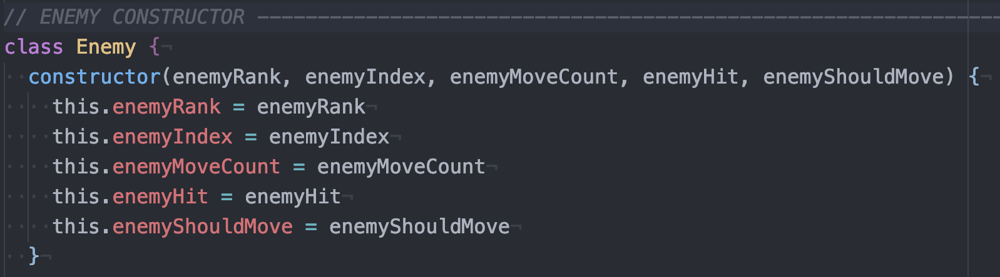
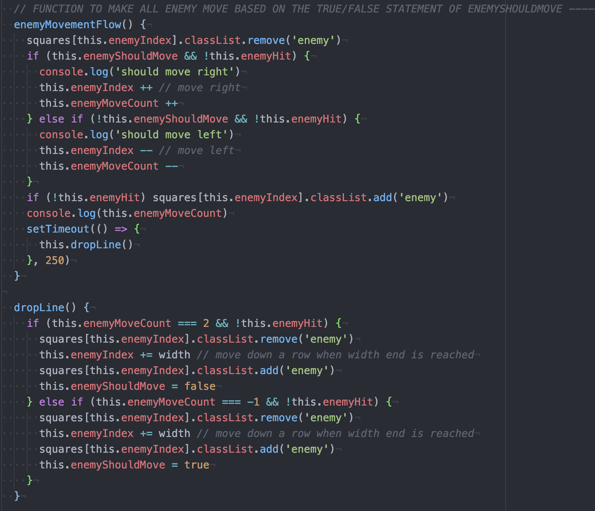

# SEI-PROJECT-1
## Space Invaders Game

**BRIEF:**

A Space Invaders type game with a Legend of Zelda Theme.

**GOAL:**

To create a single page game in which;
1) The player is able to clear at least one wave of aliens/enemies.
2) The player's score should be displayed at the end of the game.

**TIMEFRAME & TEAM:**

7 days solo project

**TECHNOLOGIES USED:**

JavaScript (ES6), HTML5, CSS, GitHub

---

**MY GAME - HYRULE INVADERS**
-

You can find a hosted version [here](http://bit.ly/sei-project-1).

#### *GAME OVERVIEW*

Hyrule Invaders is a single person game based on the same gameplay mechanics of the popular Space Invaders game from the 1980s. The aim is to shoot as many enemies as possible while they are in motion from top to bottom before they have completely descended upon you.

The player who is located at the bottom of the game board, controls the player movement (left and right only) and firing to avoid being defeated.

#### *CONTROLS*

Player movements: ←  → keys

Firing: 'S' key

Start game: "Start" button

End game: "Reset" button

#### *GAME INSTRUCTIONS*

Upon loading the single screen game displays instructions and the game play elements.

To begin the game the user will click start which will initialise the enemy movement logic and weapon firing. The player's character resides at the bottom of the screen and it's movement is controlled with the arrow keys. 

The player must shoot as many enemies as possible before they shoot the player or descend upon the player. Each successful hit on an enemy removes said enemy and increases the player score count to the left of gameplay by 100 points.

The game is won when all enemies have been destroyed.   

#### *PROCESS*

I began by creating a 10x10 grid layout in JavaScript with a view to expand if required. Inside of the grid I created two different background coloured squares which I designated as player and enemy in order to start implementing their movement logic. Once the player was resigned to the bottom of the grid and the enemy starting near the top slowly descending, I added further enemies with dropping bombs capabilities and firing missiles capability for the player. Lastly I created logic to determine impact of weapons for both the player missiles and the enemy bombs, which then reflected in the score count for the player. 

The individual enemies are created as a class, which pushes each enemy into an empty array of all enemies. The class constructor method was also adopted for creating the bomb and missile elements which also pushed into empty arrays respectively. The enemy class also contains the functions for enemy movement and impact from player missile. 

 

The enemy movement logic consists of enemy movement horizontally and vertically, all of which is based upon a boolean value associated with a movement counter for each enemy. This allowed the enemies to move along each grid square for a designated count and then dropping a line and reversing horizontal movement when said count is reached (i.e. a movement count less than width of grid). This method proved to be quite difficult when implementing for a cluster of enemies as oppose to a single enemy. 

The player firing and enemy firing is also based upon a boolean value changing from false to true when the 's' key is pressed or 'start' button is clicked, respectively. It is during said firing functions that a 'collision' check is carried out to determine whether the player or enemy has been hit and updating the score count as required. 

#### *CHALLENGES*

While there were multiple small challenges throughout the project, the main problems I encountered revolved around class constructors and timers. 

##### Constructors:
Initially I had rendered a single enemy on to the grid and created a 'movementFlow' which allowed the single enemy to move across the grid, drop down a level and then continue its movement back int he other direction. All of this while randomly firing bombs. Unfortuntately this approach could not simply be extrapolated for a class Constructor of multiple enemies. 

The solution to this particular problem involved creating an 'enemyMoveCount' property which would increase and decrease incrementally for each enemy as they moved left or right. By setting the 'enemyMoveCount' to equal 2, I could initiate a 'drop' function for the enemy armada to lower one level and carry on moving in the opposite direction until the move count returns to 0, then drops again. 

##### Timers:
Upon clicking the 'start' button for gameplay, the timer function initiates the enemy movement and the enemy firing at a set interval. During gameplay, any subsequent click of the 'start' button results in another timer being set. This increases the speed of the enemy movement and enemy firing. Clicking the 'reset' button restarts the game with a page reload. 

While the increased speed is a 'level up' feature that I hope to incorporate into the game in future, I believe the immediate solution would be to include the enemy movement and firing timers into the class constructor properties, unfortunately project time constraints did not allow for this.  

#### *WINS*
A major win for me was building the entire game from the beginning, as my very first project using vanilla JavaScript. My learning of new concepts such as class constructors, functions, scopes and timers over a few weeks were tested thoroughly during this project.

While it had taken a majority of the time alloted to achieve a minimum viable product, I was still able to spend a day utilising CSS to customise the aesthetic of the game to that of 'The Legend of Zelda' game franchise. This involved importing a third-party font and .gif images for the player and enemy images. With how quickly I was able to style the game from simple coloured blocks to a that of the final version reflects my progression from the start of this particular project. 

#### *KEY LEARNINGS*
While the project focused entirely on vanilla JavaScript, HTML and CSS, I found myself feeling a lot more comfortable with the key JavaScript concepts such as functions, scope, timers and 'if else' statements.

#### *FUTURE FEATURES*
Prior to implementing any new features I would fix the above mentioned bugs and include sound effects similar to those from the original franchise. Said sound effects would primarily be a background theme song for during gameplay and for when either enemy or player takes a 'hit'. 

Following this I would ideally like to implement different difficulties modes for the game i.e. 'beginner', 'pro', which reflect the score that a player can achieve. To complement the difficulty feature I would also look to implement a leaderboard for the score by utlitising local storage, allowing players to best their previous scores. 
